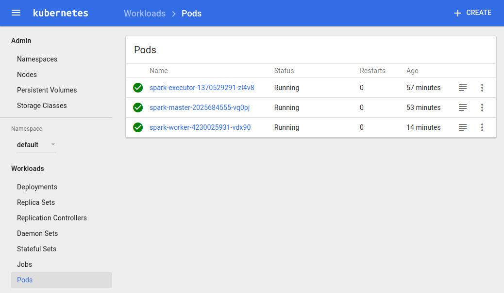

# Apache Spark in OSv on Kubernetes
This project demonstrates how one can run Apache Spark on Kubernetes using OSv unikernels.
Please note that [Virtlet](https://github.com/Mirantis/virtlet) runtime needs to be installed on the
Kubernetes in order to be able to run unikernels there.

## Deploy
Once your DIND Kubernetes cluster is up and running, you can compose the OSv unikernel
that will be used both for Spark master and Spark worker, and upload it to the imageserver:

```bash
$ ./virtlet_deploy/compose-and-upload-unikernels.sh {IMAGESERVER-POD}
```

Then you can simply deploy the whole Spark installation with:

```bash
$ kubectl create -f ./virtlet_deploy/spark-services.yaml
$ kubectl create -f ./virtlet_deploy/spark-local-master.yaml
$ kubectl create -f ./virtlet_deploy/spark-local-worker.yaml
$ kubectl create -f ./virtlet_deploy/spark-executor.yaml
```

After a minute or so you will have a Spark deployment running on your DIND cluster:



The spark-master and spark-worker pods are running inside one OSv unikernel each while the
spark-executor is running in a Docker container based on `mikelangelo/spark-executor` image.

## Run Spark job
To submit a Spark job, SparkPi for example, one needs to connect to the spark-executor container and
make use of the `spark-submit` script. For example, to submit the SparkPi demo job whos JAR can
be found at `/spark-pi.jar` (inside the spark-executor
container), one needs to run following command:

```bash
$ kubectl exec -it {SPARK-EXECUTOR-POD} -- /bin/bash
$# ./bin/spark-submit \
     --master spark://spark-master.default.svc.cluster.local:7077 \
     --deploy-mode client \
     --class org.mikelangelo.spark.examples.SparkPi \
     /spark-pi.jar \
     1000
```

Notice how we're referencing spark-master not by IP, but by k8s Service name
"spark-master.default.svc.cluster", which we've previously deployed. This way we don't even need
to manually lookup the spark-master's IP, but rather leave it to the Kubernetes to do this for us.
